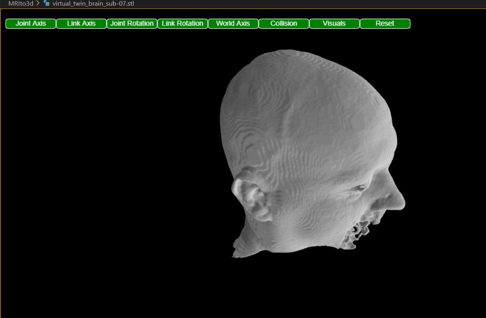
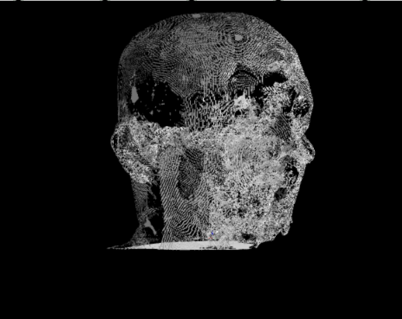
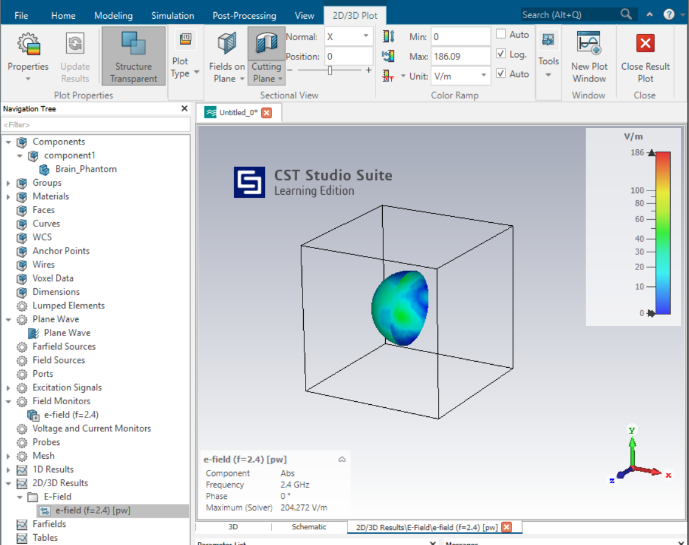

# BioEM Virtual Twin: MRI-to-Compliance Pipeline

This is a personal project I built to simulate a full R&D workflow for Bioelectromagnetics. The goal was to take a raw MRI scan, turn it into a simulation-ready "Digital Twin," and run a 2.4 GHz Wi-Fi exposure test to check for safety compliance.

## 🏗️ The Workflow

### 1. MRI Reconstruction (Python)
I started with raw NIfTI medical imaging data. I used Python (`skimage` and `numpy`) to segment the brain tissue and generate a 3D surface mesh. 
**The Challenge:** The initial mesh was "dirty"—it had gaps and way too many triangles (over 1 million) to be useful for simulation.

### 2. Mesh Optimization & Decimation
To get this into CST Studio Suite, I had to optimize the geometry. I wrote a script using `Open3D` to perform **Quadric Decimation**. 
* **The Pivot:** I reduced the mesh to about 100k triangles while maintaining the anatomical shape. 
* **Fixing Gaps:** I focused on making the mesh "watertight" so the CST physics solver wouldn't fail at the boundaries.

### 3. CST Simulation & The "License Hack"
I ran the EM simulation at 2.4 GHz (Wi-Fi standard) using a Plane Wave source.
* **Overcoming Limits:** Since I was using the CST Learning Edition, I hit a hard limit of **100,000 mesh cells**. 
* **The Solution:** A full human head at 2.4 GHz was too "electrically large." I scaled the phantom down to a 30mm biological sample and manually tuned the **Global Mesh Properties** (lowering lines per wavelength to 3) to get the cell count down to ~22,000. This allowed the physics to solve perfectly within the license constraints.

### 4. Automated Compliance (VBA & Python)
I wanted to automate the data extraction instead of doing it manually.
* **VBA:** I wrote a `.bas` macro to handle tree selection and data export within CST.
* **Python Audit:** I built a post-processor (`compliance_report.py`) that reads the exported ASCII power loss data and checks it against a safety threshold.

---

## 📊 Results Summary
* **Frequency:** 2.4 GHz
* **Peak Field:** 204.2 V/m
* **Absorbed Power:** 3.41e-07 W
* **Status:** **PASSED** ## 🛠️ Lessons Learned
* **Software Constraints:** Learning how to "dumb down" a mesh to fit license limits without losing the core physics.
* **Data Pipelines:** Bridging the gap between medical imaging (Python) and high-frequency simulation (CST) isn't always a clean process—it requires a lot of manual CAD cleanup and unit scaling.
* **VBA Automation:** Even when the UI locks certain features, understanding the underlying VBA structure allows you to write scripts that work in a professional/commercial environment.